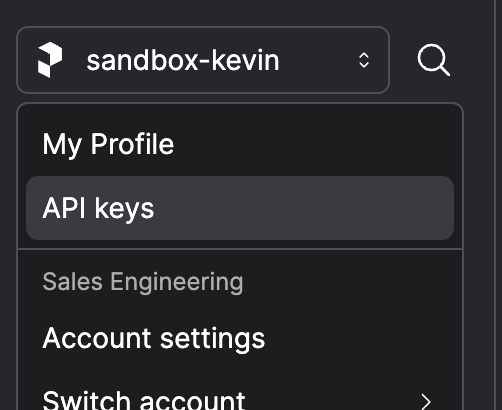
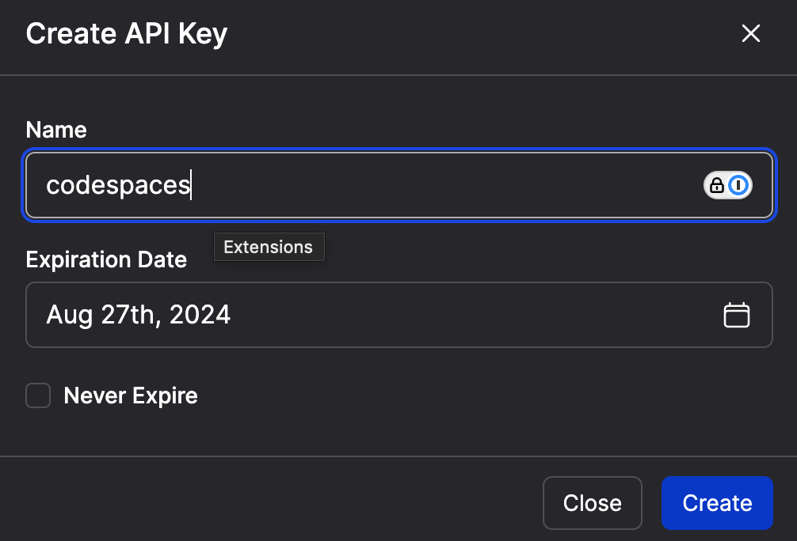
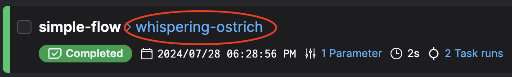
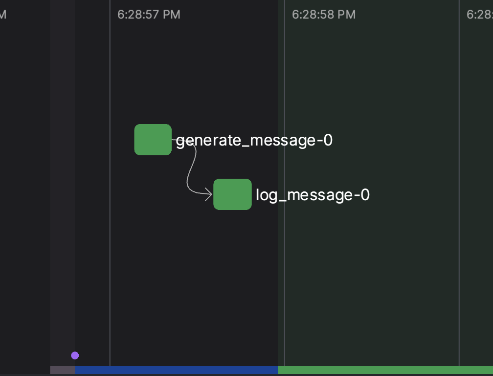
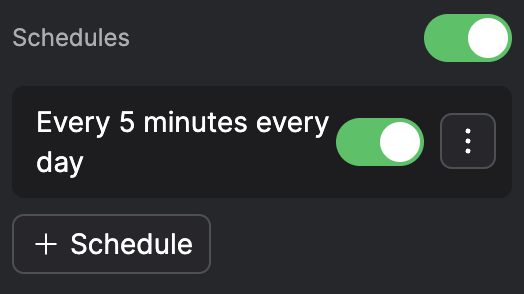

# README

## Get started with Prefect and Codespaces

### Create a Prefect API key

Go to [Prefect Cloud](https://app.prefect.cloud/auth/sign-up) and create an account and workspace.

Once logged in, create an API key.

Navigate to the account dropdown in the top right, and select "API keys".



Once on the API Keys page, click the plus at the top of the page to open the "Create API Key" form. Enter a name and click "Create".



Copy and save your API key for later use.

### Install Prefect and log in to Prefect Cloud

Connect to Codespaces and install `prefect` and `prefect-dbt`:

`pip install prefect prefect-dbt`

Once installed, log in to Prefect Cloud with your API key:

`prefect cloud login -k <your-api-key>`

Once you see the following message in your terminal, you're good to go!

`Authenticated with Prefect Cloud! Using workspace 'your-account/your-workspace'.`

## Run your first flow

### Write and execute a flow script

Clone this repository or create a file called `simple_flow.py` with the following contents:

```python
from prefect import flow, task


@flow(log_prints=True)
def simple_flow(name: str):
    message = generate_message(name)
    log_message(message)


@task
def generate_message(name: str):
    return f"Welcome to Prefect, {name}!"


@task
def log_message(message: str):
    print(message)


if __name__ == "__main__":
    simple_flow("Kevin")
```

Replace the name "Kevin" on the last line with your own name, and save the file.
Run your flow by executing `python simple_flow.py` in your terminal.

Each time a function with a `@flow` decorator is called, a flow run is created.
Cmd+Click on the link generated in your terminal, or navigate to the "Runs" page in the [Prefect Cloud UI](app.prefect.cloud) and click on the **blue, generated flow run name** to view your flow run.



### Understanding the flow run graph

Each flow run has an accompanying flow run graph.



At the center are **task runs**, a visual representation of `@task` decorated functions displayed at the time they were executed.
Task runs that share data are connected by an arrow. Since the `message` returned by the first task was passed as a parameter to the second task, `generate_message` points to `log_message`.

The colors across the bottom, which are also lightly shaded in the background of the graph, indicate the **state** of the flow run over time. This flow run went from `Pending` to `Running`, then to `Completed`. There are many other states, like `Scheduled`, `Paused`, `Failed`, and `Crashed`, each indicated by their own color.

Finally, the purple dots are **events**, which are small pieces of data emitted during a flow run that can trigger actions in other parts of the Prefect ecosystem.

**Task runs**, **states**, and **events** can all be clicked on for additional details.

## Schedule your flow

### Create a deployment

In Prefect, flows can be scheduled by promoting them to **deployments**. Deployments are containers for instructions about how, where, and when your flows should run.

Creating a deployment for a flow is as simple as calling `.serve()` on your flow function.

`simple_deployment.py` contains the same flow as before, but instead of calling it directly as a Python function, you'll deploy it inside your Codespaces instance to run once every 5 minutes.

```python
# Flow code above remains the same

if __name__ == "__main__":
    simple_flow.serve(
        cron="*/5 * * * *",
        parameters={"name": "Kevin"}
    )
```

Execute `python simple_deployment.py` in your terminal to create your deployment. Cmd+Click on the link generated in your terminal to visit the `simple-flow` deployment page.

An auto-scheduled run for this deployment will appear under the "Runs" tab of the deployment page. Prefect deployments can have multiple schedules. You can disable all schedules with the top toggle, or disable schedules with their individual corresponding toggles.



Clicking the "Run"->"Quick run" buttons in the top right of the deployment page will create a scheduled run with a start time of _now_. Give it a try!

### The limitations of `.serve()`

Creating a deployment with `.serve()` is only useful in places where your flow code is already present and runnable as a script, like your local computer or Codespaces instance. This is because `.serve()` creates a flow runner to execute your flows right where you run your script. However, these environments don't persist forever — a served deployment won't run on your laptop if it's shut off!

`.serve()` is a convenient way to to get something off the ground and schedulable quickly, but its production readiness is limited. Keep this in mind as you think about building your data pipelines.

Press Ctrl+C in your terminal to shut down your served flow.

## Work Pools

To make your deployment truly durable, it needs to be deployed to the cloud, where there are compute resources always ready to run your code. In Prefect, those execution environments are represented as **work pools**.

### Create a managed work pool

Go to the "Work Pools" page in the [Prefect Cloud UI](app.prefect.cloud) and click the plus button at the top of the page. Select "Prefect Managed" and name work your pool "managed-pool". Click "Next", then click "Create".

Let's deploy your flow again, but this time to your Prefect Managed work pool.
First, since this deployment will be running your flow in a remote execution environment where the code isn't currently present, we'll need to tell Prefect where to find your code. `flow.from_source()` allows you to specify a repository where your code is stored, as well as an `entrypoint`, which is the path to your `<flow_file>:<flow_function>` from the root of the repository.
Then all we need to do is swap `serve` with `deploy`, and add the `work_pool_name="managed-pool"` parameter.

```python
if __name__ == "__main__":
    flow.from_source(
        source="https://github.com/Generation-Data/prefect-examples.git",
        entrypoint="simple_flow.py:simple_flow",
    ).deploy(
        work_pool_name="managed-pool",
        cron="*/5 * * * *",
        parameters={"name": "Kevin"}
    )
```